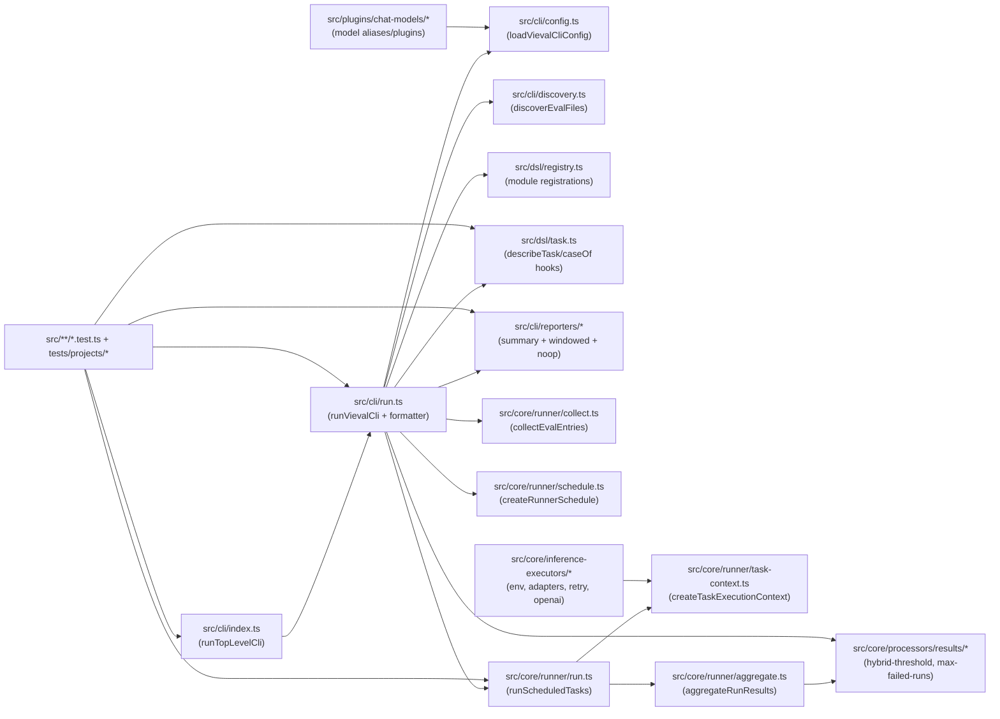
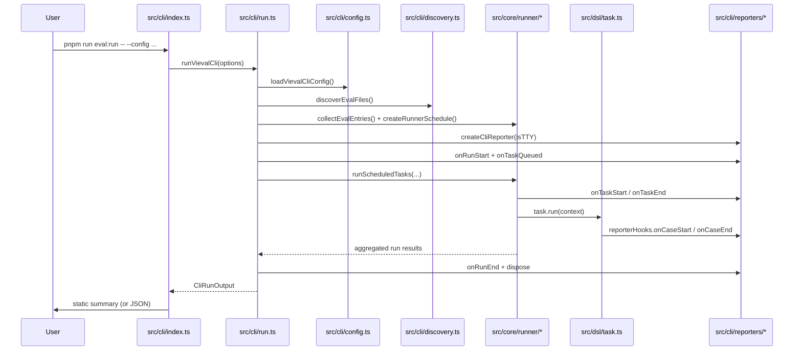

# Vieval

Evaluation framework based on Vitest, the testing framework you familiar with, for agents, models, and more.

## Structure

- `vieval.config.ts`: shared eval module contracts
- `src/core/runner/*`: reusable collection/scheduling/execution/aggregation utilities
- `src/core/assertions/*`: reusable assertion and rubric helpers
- `src/core/processors/results/*`: threshold and hard-limit gating policies
- `vitest.config.ts`: isolated test config for this package
- `tests/projects/*`: fixture mini-projects for runner and path tests

Scenario/eval definitions should live near business agent implementations, for example:
- `plugins/airi-plugin-game-chess/src/agent/evals/chess-commentary.eval.ts`

## Matrix Scopes

`vieval` expands matrices in three layers:

- `project` scope from `vieval.config.*`
- `eval` scope from `*.eval.ts`
- `task` scope from `defineTask(...)`

Each scope can contribute `runMatrix` and `evalMatrix` blocks. The runner resolves them in scope order `project -> eval -> task`, and within each scope it applies `disable -> extend -> override`.

### Matrix rules

- `disable` removes axes before any additions or replacements.
- `extend` adds axes or appends axis values without discarding earlier values.
- `override` replaces the axis values already visible at that scope.
- Pure axis objects and pure layer objects are both accepted.
- Mixed objects that combine reserved layer keys with axis keys are rejected with an `Ambiguous matrix definition` error.

### Legacy mapping

`matrix` is still supported as a compatibility alias for `runMatrix.extend`.

```ts
defineConfig({
  projects: [
    {
      name: 'legacy-project',
      matrix: {
        model: ['gpt-4.1-mini'],
      },
    },
  ],
})
```

That is normalized to:

```ts
defineConfig({
  projects: [
    {
      name: 'legacy-project',
      runMatrix: {
        extend: {
          model: ['gpt-4.1-mini'],
        },
      },
    },
  ],
})
```

### Control-group example

This example keeps runtime and judging controls separate while still producing a single combined schedule:

```ts
defineConfig({
  projects: [
    {
      name: 'chat-evals',
      runMatrix: {
        extend: {
          model: ['gpt-4.1-mini', 'gpt-4.1'],
          promptLanguage: ['en', 'zh'],
        },
      },
      evalMatrix: {
        extend: {
          rubric: ['strict', 'lenient'],
        },
      },
    },
  ],
})
```

If an eval or task narrows the experiment, the same precedence rules still apply:

```ts
defineEval({
  matrix: {
    runMatrix: {
      disable: ['promptLanguage'],
      extend: {
        promptLanguage: ['en'],
      },
    },
    evalMatrix: {
      override: {
        rubric: ['strict'],
      },
    },
  },
})
```

### Structured matrix artifact

Each scheduled run carries a structured matrix artifact with:

- `run`
- `eval`
- `meta.runRowId`
- `meta.evalRowId`

That artifact is stable across collection, scheduling, execution, and aggregation, so downstream analysis can group results by model, rubric, prompt language, or any other axis combination.

## Architecture



### Connection Notes

- `src/cli/run.ts` is the integration hub: it loads config, discovers eval files, prepares schedules, runs tasks, emits live reporter events, and formats static summaries.
- `src/dsl/task.ts` emits case lifecycle hooks (`onCaseStart` / `onCaseEnd`) that feed the live reporter when `reporterHooks` is present in task context.
- `src/core/runner/run.ts` owns task lifecycle (`onTaskStart` / `onTaskEnd`) and result aggregation boundaries.
- `src/cli/reporters/summary-reporter.ts` and `src/cli/reporters/renderers/windowed-renderer.ts` provide the Vitest-style live TTY experience; non-TTY falls back to noop reporter + final static formatter.

### Runtime Sequence (`eval:run`)



## Run Eval Projects

`vieval` runs eval projects discovered from `vieval.config.*` (auto-discovered from current working directory unless `--config` is provided).

Run with auto-discovery:

```bash
pnpm run eval:run
```

Run with explicit config:

```bash
pnpm run eval:run -- --config plugins/airi-plugin-game-chess/vieval.config.ts
```

Inject env values from config (Vitest-style pattern):

```ts
import { join } from 'node:path'
import { cwd } from 'node:process'

import { defineConfig, loadEnv } from 'vieval'

export default defineConfig({
  env: loadEnv('test', join(cwd(), 'packages', 'stage-ui'), ''),
  projects: [{ name: 'my-project' }],
})
```

Run only selected projects (repeat `--project`):

```bash
pnpm run eval:run -- --config plugins/airi-plugin-game-chess/vieval.config.ts --project chess
pnpm run eval:run -- --config path/to/vieval.config.ts --project chess --project moderation
```

Print machine-readable output:

```bash
pnpm run eval:run -- --json
```

Help:

```bash
pnpm run eval:run -- --help
node --import tsx packages/vieval/src/cli/index.ts help
```

Run package tests:

```bash
pnpm run test:run
```

## Custom Inference Executor

Use `projects[].executor` when you want non-chat inference workloads (for example ASR, TTS, motion generation, 3D generation, or image generation).

```ts
import { defineConfig } from 'vieval'

export default defineConfig({
  projects: [
    {
      name: 'motion-evals',
      inferenceExecutors: [{ id: 'motion-engine' }],
      models: [
        {
          id: 'motion-engine:v2',
          inferenceExecutor: 'motion-engine',
          inferenceExecutorId: 'motion-engine',
          model: 'v2',
          aliases: ['motion-default'],
        },
      ],
      async executor(task, context) {
        const selectedModel = context.model()
        const runVariant = task.matrix.run

        // Replace this with your own inference call.
        const success = selectedModel.model === 'v2' && runVariant.scenario === 'baseline'

        return {
          id: task.id,
          entryId: task.entry.id,
          inferenceExecutorId: task.inferenceExecutor.id,
          matrix: task.matrix,
          scores: [
            { kind: 'exact', score: success ? 1 : 0 },
          ],
        }
      },
    },
  ],
})
```

Notes:

- `task.inferenceExecutor.id` is the scheduled executor target for this run.
- `context.model()` resolves the task model (including matrix-selected model aliases).
- Your executor only needs to return normalized score entries (`0..1`) and metadata fields.

### CLI Reporter Behavior

The CLI uses a live summary reporter only when stdout is a TTY.

- TTY runs show in-place active rows in the form `❯ <badge> <task-name> <completed>/<total>`.
- Queued tasks show `❯ <badge> <task-name> [queued]` until the task starts.
- Slow cases appear as nested rows under the active task once they exceed the slow threshold, with the elapsed time shown in yellow.
- The footer updates live with `Tasks` and `Cases` counters, plus `Start at` and `Duration`.
- Non-TTY runs skip live redraws and use the silent reporter path, so only the final static CLI summary is emitted.
- The slow-case threshold defaults to `300ms`.

## Task 1 Verification

Task 1 followed a fail-first then pass cycle for `collectEvalEntries`.

Red phase:

```bash
pnpm exec vitest run --config packages/vieval/vitest.config.ts packages/vieval/src/core/runner/collect.test.ts
```

Summary: failed with `Cannot find module '../collect'` before `collect.ts` existed.

Green phase:

```bash
pnpm exec vitest run --config packages/vieval/vitest.config.ts packages/vieval/src/core/runner/collect.test.ts
```

Summary: `1` test file passed and `4` tests passed from this worktree after the runner implementation and local `node_modules` symlink were in place.

## Task 7 Verification

Task 7 used this command set:

```bash
pnpm exec vitest run packages/vieval/src/cli/*.test.ts packages/vieval/src/core/runner/*.test.ts packages/vieval/src/dsl/task.test.ts --config packages/vieval/vitest.config.ts
pnpm -F vieval typecheck
```

Summary: both commands passed.
