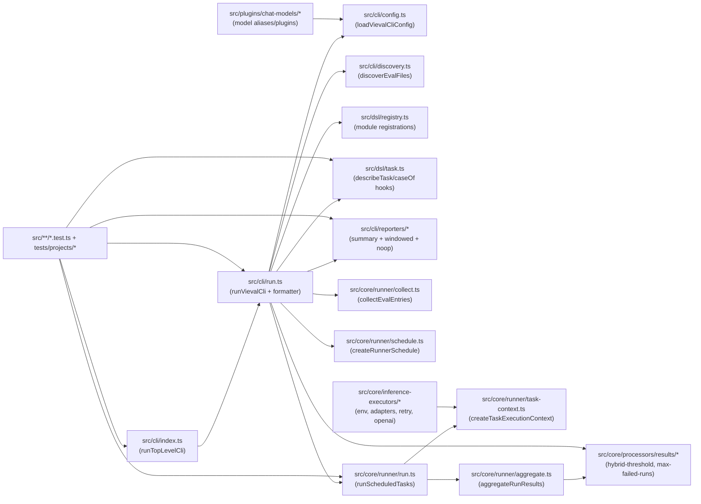
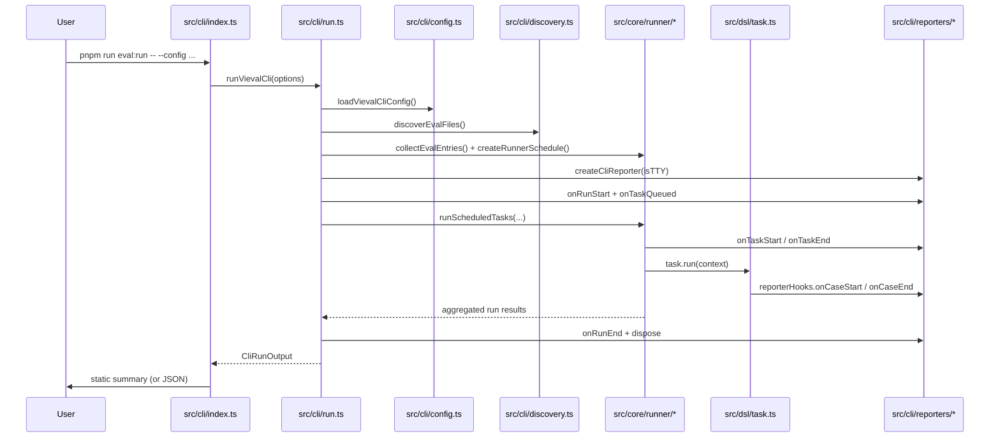

# Vieval

[![npm version][npm-version-src]][npm-version-href]
[![npm downloads][npm-downloads-src]][npm-downloads-href]
[![bundle][bundle-src]][bundle-href]
[![JSDocs][jsdocs-src]][jsdocs-href]
[![License][license-src]][license-href]
[![Ask DeepWiki][deepwiki-src]][deepwiki-href]

Vitest-style evaluation framework for agents, models, and task pipelines.

`vieval` keeps eval authoring close to product code while giving you repeatable project/eval/task matrix runs and a CLI summary experience.

## Why Vieval

- Familiar authoring model (`describeEval`, `caseOf`, `expect`) instead of a separate eval DSL language.
- Matrix control at three levels (project, eval, task) with deterministic merge rules.
- Works for chat and non-chat workloads through custom `projects[].executor`.
- Human-readable TTY output and machine-readable JSON output from the same command.

## Quick Start

### 1) Create a config

```ts
// vieval.config.ts
import { defineConfig } from 'vieval'

export default defineConfig({
  projects: [
    {
      name: 'default',
      root: '.',
      include: ['evals/*.eval.ts'],
    },
  ],
})
```

### 2) Create an eval

```ts
// evals/smoke.eval.ts
import { caseOf, describeEval, expect } from 'vieval'

export default describeEval('smoke', () => {
  caseOf('2 + 2 = 4', () => {
    expect(2 + 2).toBe(4)
  }, {})
})
```

### 3) Run

```bash
pnpm -F vieval eval:run -- --config ./vieval.config.ts
```

## Core Concepts

### Matrix layering

`vieval` expands matrices in scope order:

1. `project` from `vieval.config.*`
2. `eval` from `*.eval.ts`
3. `task` from `defineTask(...)`

Within each scope, matrix layers apply in this order:

1. `disable`
2. `extend`
3. `override`

Both `runMatrix` and `evalMatrix` are supported at each scope.

### Matrix compatibility alias

`matrix` remains supported as a compatibility alias for `runMatrix.extend`.

### Stable matrix artifact

Each scheduled run includes:

- `matrix.run`
- `matrix.eval`
- `matrix.meta.runRowId`
- `matrix.meta.evalRowId`

Use these fields to group and compare runs across models, rubrics, and scenarios.

## Architecture



### Connection Notes

- `src/cli/run.ts` is the integration hub: it loads config, discovers eval files, prepares schedules, runs tasks, emits live reporter events, and formats static summaries.
- `src/dsl/task.ts` emits case lifecycle hooks (`onCaseStart` / `onCaseEnd`) that feed the live reporter when `reporterHooks` is present in task context.
- `src/core/runner/run.ts` owns task lifecycle (`onTaskStart` / `onTaskEnd`) and result aggregation boundaries.
- `src/cli/reporters/summary-reporter.ts` and `src/cli/reporters/renderers/windowed-renderer.ts` provide the Vitest-style live TTY experience; non-TTY falls back to noop reporter + final static formatter.

### Runtime Sequence (`eval:run`)



## Config Example (Control Group Style)

```ts
import { defineConfig } from 'vieval'

export default defineConfig({
  projects: [
    {
      name: 'chat-evals',
      runMatrix: {
        extend: {
          model: ['gpt-4.1-mini', 'gpt-4.1'],
          promptLanguage: ['en', 'zh'],
          scenario: ['baseline', 'stress'],
        },
      },
      evalMatrix: {
        extend: {
          rubric: ['strict', 'lenient'],
          rubricModel: ['judge-mini', 'judge-large'],
        },
      },
    },
  ],
})
```

## Custom Executor Example

Use `projects[].executor` for non-chat workloads such as ASR, TTS, image, motion, or other domain-specific evaluators.

```ts
import { defineConfig } from 'vieval'

export default defineConfig({
  projects: [
    {
      name: 'motion-evals',
      inferenceExecutors: [{ id: 'motion-engine' }],
      models: [
        {
          id: 'motion-engine:v2',
          inferenceExecutor: 'motion-engine',
          inferenceExecutorId: 'motion-engine',
          model: 'v2',
          aliases: ['motion-default'],
        },
      ],
      async executor(task, context) {
        const model = context.model()
        const success = model.model === 'v2' && task.matrix.run.scenario === 'baseline'

        return {
          id: task.id,
          entryId: task.entry.id,
          inferenceExecutorId: task.inferenceExecutor.id,
          matrix: task.matrix,
          scores: [{ kind: 'exact', score: success ? 1 : 0 }],
        }
      },
    },
  ],
})
```

## CLI

```bash
vieval run [--config <path>] [--project <name>] [--json]
```

Common usage:

```bash
pnpm -F vieval eval:run
pnpm -F vieval eval:run -- --config ./vieval.config.ts
pnpm -F vieval eval:run -- --config ./vieval.config.ts --project chess --project moderation
pnpm -F vieval eval:run -- --json
pnpm -F vieval eval:run -- --help
```

## Examples In This Repository

- [Define a custom eval task API](tests/projects/example-api-defining-new-task)
- [Configure run/eval matrix combinations](tests/projects/example-api-config-matrix)
- [Load datasource records as task cases](tests/projects/example-api-load-datasource-as-cases)
- [Compare reporters and experiment/attempt layering](tests/projects/example-api-reporters-and-experiments)
- [Bring your own agent execution pattern](tests/projects/example-pattern-byoa-bring-your-own-agent)

## Development

```bash
pnpm install
pnpm -F vieval test:run
pnpm -F vieval typecheck
pnpm lint:fix
```

## When To Use / Not Use

Use `vieval` when:

- you want evals close to app code with Vitest-like ergonomics;
- you need matrix experiments and repeatable run metadata;
- you want one CLI for local diagnostics and CI export (`--json`).

Do not use `vieval` when:

- you need hosted dataset management, annotation UI, or SaaS observability out of the box;
- you only need one-off scripts without reusable eval definitions or matrix scheduling.

## Acknowledgements

- [Vitest](https://github.com/vitest-dev/vitest)
- [LobeHub](https://github.com/lobehub/lobehub)
- [EvalSys](https://github.com/evalsys)

## License

MIT

[npm-version-src]: https://img.shields.io/npm/v/vieval?style=flat&colorA=080f12&colorB=1fa669
[npm-version-href]: https://npmjs.com/package/vieval
[npm-downloads-src]: https://img.shields.io/npm/dm/vieval?style=flat&colorA=080f12&colorB=1fa669
[npm-downloads-href]: https://npmjs.com/package/vieval
[bundle-src]: https://img.shields.io/bundlephobia/minzip/vieval?style=flat&colorA=080f12&colorB=1fa669&label=minzip
[bundle-href]: https://bundlephobia.com/result?p=vieval
[license-src]: https://img.shields.io/github/license/vieval-dev/vieval.svg?style=flat&colorA=080f12&colorB=1fa669
[license-href]: https://github.com/vieval-dev/vieval/blob/main/LICENSE
[jsdocs-src]: https://img.shields.io/badge/jsdocs-reference-080f12?style=flat&colorA=080f12&colorB=1fa669
[jsdocs-href]: https://www.jsdocs.io/package/vieval
[deepwiki-src]: https://deepwiki.com/badge.svg
[deepwiki-href]: https://deepwiki.com/vieval-dev/vieval
