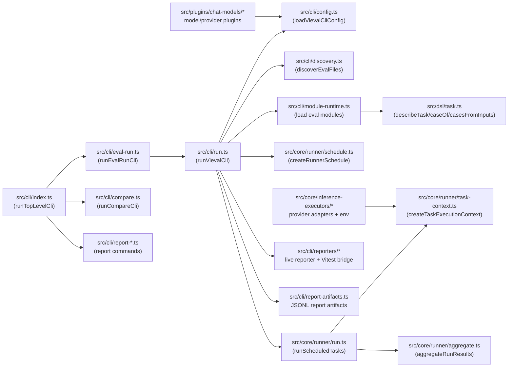
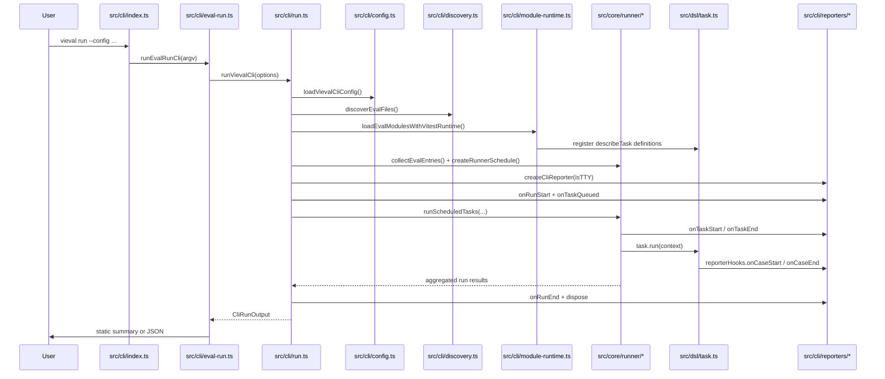

# Vieval

[![npm version][npm-version-src]][npm-version-href]
[![npm downloads][npm-downloads-src]][npm-downloads-href]
[![bundle][bundle-src]][bundle-href]
[![JSDocs][jsdocs-src]][jsdocs-href]
[![License][license-src]][license-href]
[![Ask DeepWiki][deepwiki-src]][deepwiki-href]

Vitest-style evaluation framework for agents, models, and task pipelines.

`vieval` keeps eval authoring close to product code while giving you repeatable task discovery, matrix scheduling, live CLI output, JSON artifacts, and report commands.

## Why Vieval

- Familiar eval files with `describeTask`, `caseOf`, `casesFromInputs`, and `expect`.
- Project, eval, and task matrix layers for model, scenario, rubric, and dataset variants.
- Built-in chat-model registration through `ChatModels`, plus custom project executors for non-chat workloads.
- Human-readable terminal output and machine-readable JSON/report artifacts from the same CLI.
- Importable runner, scheduler, assertion, config, plugin, and testing entrypoints for advanced integration.

## Quick Start

### Step 1. Create a config

```ts
// vieval.config.ts
import { defineConfig } from 'vieval'
import { chatModelFrom, ChatModels } from 'vieval/plugins/chat-models'

export default defineConfig({
  plugins: [
    ChatModels({
      models: [
        chatModelFrom({
          aliases: ['agent-mini', 'judge-mini'],
          inferenceExecutor: 'openai',
          model: 'gpt-4.1-mini',
        }),
      ],
    }),
  ],
  projects: [
    {
      name: 'default',
      root: '.',
      include: ['evals/*.eval.ts'],
      runMatrix: {
        extend: {
          model: ['agent-mini'],
          scenario: ['baseline'],
        },
      },
      evalMatrix: {
        extend: {
          rubric: ['default'],
        },
      },
    },
  ],
})
```

### Step 2. Create an eval task

```ts
// evals/smoke.eval.ts
import { caseOf, describeTask, expect } from 'vieval'

describeTask('smoke', () => {
  caseOf('arithmetic-default', (context) => {
    expect(context.task.matrix.run.scenario).toBe('baseline')
    expect(2 + 2).toBe(4)
  }, {
    input: {
      prompt: 'Check simple arithmetic.',
    },
  })
})
```

### Step 3. Run

```bash
pnpm -F vieval eval:run -- --config ./vieval.config.ts
```

The published binary form is:

```bash
vieval run --config ./vieval.config.ts
```

## Authoring API

Use `describeTask` for the common Vitest-like authoring path:

```ts
import { caseOf, describeTask, expect } from 'vieval'

describeTask('prompt-language-ablation', () => {
  caseOf('resolves matrix axes', async (context) => {
    const selectedModel = context.model()
    const language = context.task.matrix.run.promptLanguage
    const scenario = context.task.matrix.run.scenario

    expect(selectedModel.id.length).toBeGreaterThan(0)
    expect(language).toBeDefined()
    expect(scenario).toBeDefined()
  }, {
    input: {
      prompt: 'Summarize the position in one sentence.',
    },
  })
})
```

Use builder style when loading a batch of inputs:

```ts
import { describeTask, expect } from 'vieval'

const arithmeticCases = [
  { name: 'addition-small', input: { a: 1, b: 2, expected: 3 } },
  { name: 'addition-large', input: { a: 20, b: 22, expected: 42 } },
]

describeTask('arithmetic-quality', ({ casesFromInputs }) => {
  casesFromInputs('arithmetic-case', arithmeticCases, ({ matrix }) => {
    const result = matrix.inputs.input.a + matrix.inputs.input.b
    expect(result).toBe(matrix.inputs.input.expected)
  })
})
```

`describeEval` remains exported as an alias of `describeTask`, but new examples should prefer `describeTask` because task/case semantics are the primary runtime model.

## Matrix Model

`vieval` expands matrix scopes in this order:

1. Project config from `vieval.config.*`.
2. Eval definition from `defineEval(...)`.
3. Task definition from `defineTask(...)`.

Within each scope, matrix layers resolve in this order:

1. `disable`
2. `extend`
3. `override`

Both `runMatrix` and `evalMatrix` are supported at project, eval, and task scope. A flat object such as `runMatrix: { scenario: ['baseline'] }` is normalized to `runMatrix.extend`; layered form is preferred for new docs and examples.

Each scheduled task receives stable matrix metadata:

- `task.matrix.run`
- `task.matrix.eval`
- `task.matrix.meta.runRowId`
- `task.matrix.meta.evalRowId`
- `task.matrix.inputs` for `caseOf(..., { input })` and `casesFromInputs(...)`

## Config Example

```ts
import { defineConfig } from 'vieval'
import { chatModelFrom, ChatModels } from 'vieval/plugins/chat-models'

export default defineConfig({
  plugins: [
    ChatModels({
      models: [
        chatModelFrom({
          aliases: ['agent-mini', 'judge-mini'],
          inferenceExecutor: 'openai',
          model: 'gpt-4.1-mini',
        }),
        chatModelFrom({
          aliases: ['agent-large', 'judge-large'],
          inferenceExecutor: 'openai',
          model: 'gpt-4.1',
        }),
        chatModelFrom({
          aliases: ['agent-openrouter-mini'],
          inferenceExecutor: 'openrouter',
          model: 'openai/gpt-4.1-mini',
        }),
      ],
    }),
  ],
  projects: [
    {
      name: 'chat-evals',
      root: '.',
      include: ['evals/*.eval.ts'],
      runMatrix: {
        extend: {
          model: ['agent-mini', 'agent-large'],
          promptLanguage: ['en', 'zh'],
          scenario: ['baseline', 'stress'],
        },
      },
      evalMatrix: {
        extend: {
          rubric: ['strict', 'lenient'],
          rubricModel: ['judge-mini', 'judge-large'],
        },
      },
    },
  ],
})
```

## Custom Executor

If a project provides no `executor`, `vieval run` still discovers eval files, schedules tasks, and executes module-defined task callbacks. Provide `projects[].executor` when a project needs custom execution for ASR, TTS, image, motion, hosted agents, or another domain runtime.

```ts
import { defineConfig } from 'vieval'

export default defineConfig({
  projects: [
    {
      name: 'motion-evals',
      root: '.',
      include: ['evals/*.eval.ts'],
      inferenceExecutors: [{ id: 'motion-engine' }],
      models: [
        {
          id: 'motion-engine:v2',
          aliases: ['motion-default'],
          inferenceExecutor: 'motion-engine',
          inferenceExecutorId: 'motion-engine',
          model: 'v2',
        },
      ],
      async executor(task, context) {
        const model = context.model({ name: 'motion-default' })
        const success = model.model === 'v2' && task.matrix.run.scenario === 'baseline'

        return {
          id: task.id,
          entryId: task.entry.id,
          inferenceExecutorId: task.inferenceExecutor.id,
          matrix: task.matrix,
          scores: [{ kind: 'exact', score: success ? 1 : 0 }],
        }
      },
    },
  ],
})
```

## CLI

```bash
vieval run [--config <path>] [--project <name>] [--json] [--report-out <path>]
vieval compare [--config <path>] [--comparison <id>] [--output <path>] [--format table|json]
vieval report analyze <report-directory>
vieval report index <report-directory> [--output <path>] [--format table|json|jsonl]
vieval report cases <report-directory> [--where <key=value>] [--group-by <key>] [--format table|json|jsonl]
vieval report compare <left-report-directory> <right-report-directory> [--case-key <key>] [--score-kind <kind>] [--format table|json]
```

Common workspace commands:

```bash
pnpm install
pnpm -F vieval eval:run
pnpm -F vieval eval:run -- --config ./vieval.config.ts
pnpm -F vieval eval:run -- --config ./vieval.config.ts --project chess --project moderation
pnpm -F vieval eval:run -- --json
pnpm -F vieval eval:run -- --report-out .vieval/reports --workspace local --experiment prompt-v2 --attempt attempt-a
pnpm -F vieval exec tsx src/bin/vieval.ts compare --config ./vieval.config.ts --comparison agent-memory
pnpm -F vieval exec tsx src/bin/vieval.ts report analyze .vieval/reports/my-run
pnpm -F vieval eval:run -- --help
```

Concurrency flags are available on `vieval run`:

- `--workspace-concurrency`
- `--project-concurrency`
- `--task-concurrency`
- `--attempt-concurrency`
- `--case-concurrency`

## Public Entrypoints

- `vieval`: `defineConfig`, `loadEnv`, `requiredEnvFrom`, `describeTask`, `describeEval`, `caseOf`, `casesFromInputs`, and `expect`.
- `vieval/config`: lower-level `defineEval`, `defineTask`, matrix types, task context types, model definitions, and plugin contracts.
- `vieval/plugins/chat-models`: `ChatModels`, `ChatProviders`, `chatModelFrom`, `chatProviderFrom`, `chatModelMatrix`, runtime config helpers, and chat telemetry helpers.
- `vieval/core/runner`: collection, scheduling, task context, cache runtime, scheduler runtime, execution, and aggregation utilities.
- `vieval/core/assertions`: assertion primitives and pipeline helpers.
- `vieval/core/inference-executors`: env helpers and remote provider executors.
- `vieval/testing/expect-extensions`: Vitest expect extensions for testing eval behavior.

## Architecture



### Runtime Sequence



## Examples In This Repository

- [Define a custom eval task API](tests/projects/example-api-defining-new-task)
- [Configure run/eval matrix combinations](tests/projects/example-api-config-matrix)
- [Load datasource records as task cases](tests/projects/example-api-load-datasource-as-cases)
- [Use assertion helpers and Vitest expect extensions](tests/projects/example-api-expect)
- [Compare reporters and experiment/attempt layering](tests/projects/example-api-reporters-and-experiments)
- [Bring your own agent execution pattern](tests/projects/example-pattern-byoa-bring-your-own-agent)

## Development

```bash
pnpm install
pnpm -F vieval test:run
pnpm -F vieval typecheck
pnpm lint
```

## When To Use / Not Use

Use `vieval` when:

- you want evals close to app code with Vitest-like ergonomics;
- you need repeatable matrix experiments and stable run metadata;
- you want local diagnostics, CI JSON, and report artifacts from one runner;
- you need to evaluate product code or custom agent flows without moving them into a hosted eval system.

Do not use `vieval` when:

- you need hosted dataset management, annotation UI, or SaaS observability out of the box;
- you only need a one-off script without reusable eval definitions or matrix scheduling.

## Acknowledgements

- [Vitest](https://github.com/vitest-dev/vitest)
- [LobeHub](https://github.com/lobehub/lobehub)
- [EvalSys](https://github.com/evalsys)

## License

MIT

[npm-version-src]: https://img.shields.io/npm/v/vieval?style=flat&colorA=080f12&colorB=1fa669
[npm-version-href]: https://npmjs.com/package/vieval
[npm-downloads-src]: https://img.shields.io/npm/dm/vieval?style=flat&colorA=080f12&colorB=1fa669
[npm-downloads-href]: https://npmjs.com/package/vieval
[bundle-src]: https://img.shields.io/bundlephobia/minzip/vieval?style=flat&colorA=080f12&colorB=1fa669&label=minzip
[bundle-href]: https://bundlephobia.com/result?p=vieval
[license-src]: https://img.shields.io/github/license/vieval-dev/vieval.svg?style=flat&colorA=080f12&colorB=1fa669
[license-href]: https://github.com/vieval-dev/vieval/blob/main/LICENSE
[jsdocs-src]: https://img.shields.io/badge/jsdocs-reference-080f12?style=flat&colorA=080f12&colorB=1fa669
[jsdocs-href]: https://www.jsdocs.io/package/vieval
[deepwiki-src]: https://deepwiki.com/badge.svg
[deepwiki-href]: https://deepwiki.com/vieval-dev/vieval
